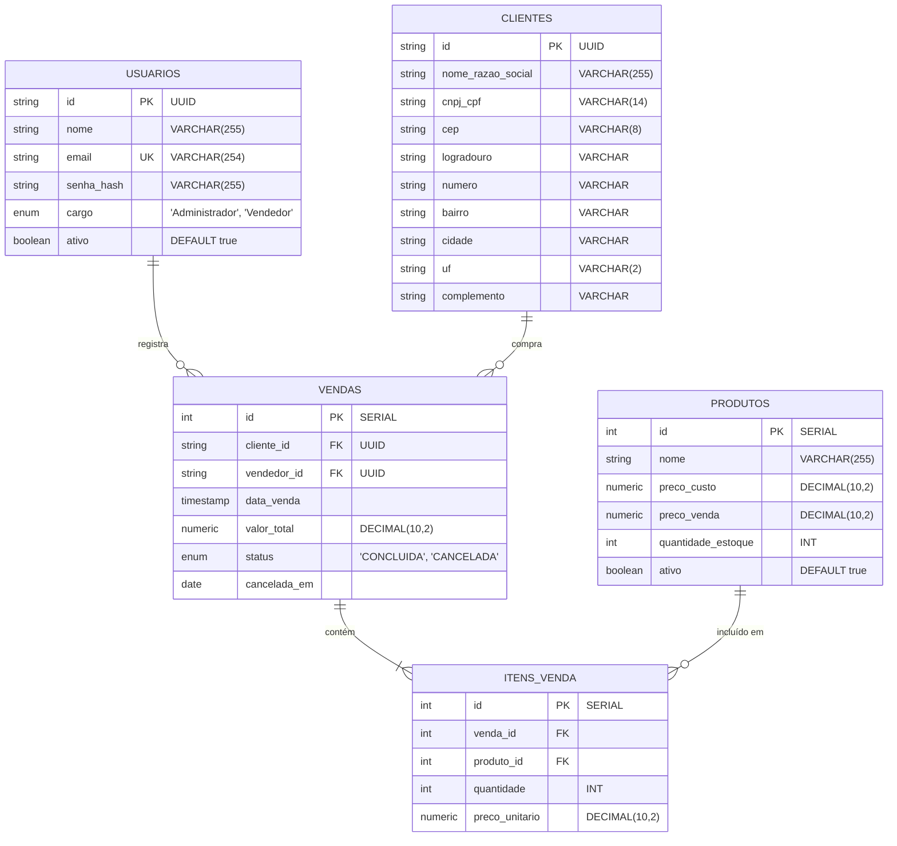

## 📦 Sistema de Gestão Simplificado

A ideia central desse sistema de gestão é simular o dia a dia operacional e administrativo de uma empresa de varejo ou distribuidora. O objetivo é gerenciar o ciclo completo de uma comercialização: comprar/cadastrar produtos no estoque $\rightarrow$ cadastrar clientes $\rightarrow$ registrar a venda $\rightarrow$ dar baixa automática no estoque $\rightarrow$ analisar os resultados do negócio.

---

## 1. 🚀 Visão Geral e Objetivo

### O sistema gerencia o ciclo completo de comercialização de uma empresa de varejo. Ele cobre desde o controle de estoque e cadastro de clientes até o registro de vendas com baixa automática de mercadorias, concorrência de dados e geração de relatórios gerenciais.

## 2. 🛠️ Stack Tecnológica

| Camada         | Tecnologia       | Motivação / Uso                                                  |
| -------------- | ---------------- | ---------------------------------------------------------------- |
| Linguagem      | TypeScript       | Tipagem estática e segurança em tempo de desenvolvimento.        |
| Backend        | NestJS (Node.js) | Arquitetura sólida baseada em módulos e injeção de dependência.  |
| Frontend       | React            | Construção de interface de usuário componentizada e SPA.         |
| Banco de Dados | PostgreSQL       | Banco relacional robusto para garantir consistência ACID.        |
| ORM            | TypeORM          | Mapeamento objeto-relacional com suporte nativo a transações.    |
| Testes         | Jest             | Testes unitários e de integração automatizados.                  |
| Infraestrutura | Docker           | Containerização do banco de dados para consistência de ambiente. |

---

## 3. 👥 Perfis de Acesso (Atores)

### 🔴 Administrador (Gerencial + Operacional)

- Gestão de Usuários: Cadastrar, editar, alterar cargos e inativar usuários.
- Gestão de Estoque: Cadastrar produtos, ajustar inventário manualmente e definir preços.
- Operações Avançadas: Cancelar/estornar vendas com devolução automática ao estoque.
- Métricas: Visualizar faturamento total, margem de lucro e produtos mais vendidos.
- Acesso Total: Executa todas as funções do perfil Vendedor.

### 🔵 Vendedor (Operacional)

- Gestão de Clientes: Cadastrar e consultar clientes.
- Consulta de Produtos: Verificar preços e disponibilidade real em estoque.
- Vendas: Registrar pedidos, aplicar descontos permitidos e finalizar transações.
- Produtividade: Acessar histórico exclusivo das suas próprias vendas realizadas.

---

## 4. 📐 Arquitetura de Dados (Diagrama ER)

---

## 5. 🛡️ Regras de Negócio Cruciais (Business Rules)

- RN-01 (Segurança de Credenciais): A senha do usuário deve ser criptografada com bcrypt antes de salvar. O campo senha_hash deve ser explicitamente ocultado (select: false) em consultas padrão de banco de dados.
- RN-02 (Fluxo de Venda): Uma venda só pode ser concluída se houver estoque suficiente para todos os itens solicitados. Caso um único item falhe, toda a operação da venda deve ser rejeitada (Transação Atômica).
- RN-03 (Estorno de Venda): O cancelamento de vendas é exclusivo do perfil Administrador. Ao cancelar, o status muda para CANCELADA, a data é registrada em cancelada_em e as quantidades de Itens_Venda devem ser devolvidas ao estoque dos produtos imediatamente.
- RN-04 (Autenticação): Rotas operacionais e gerenciais exigem autenticação via token JWT emitido após login válido.

---

## 6. ⚙️ Requisitos Técnicos e Engenharia

### ⚡ Concorrência e Estado (Race Condition)

Para mitigar compras simultâneas do último item do estoque, o sistema implementará controle de concorrência:

- Estratégia: Bloqueio Pessimista (Pessimistic Locking) nas tabelas de estoque durante a abertura da transação da venda para evitar leituras sujas.

### 🔌 Integrações Externas

- ViaCEP API: O cadastro de clientes deve consumir a API externa via requisições HTTP para preencher os campos de endereço automaticamente após a digitação do CEP.

### 🧪 Qualidade de Código e Validação

- Validação de Entrada: Uso obrigatório de class-validator e class-transformer globalmente nos DTOs da API para barrar payloads inválidos antes de atingirem os Controllers.
- Testes: Cobertura de testes unitários para serviços de cálculo e testes de integração (E2E) para o fluxo crítico de vendas usando Jest.

---

Para detalhes sobre a configuração da API, acesse o [README do Backend](./backend/README.md). Já se estiver interessado sobre detalhes da interface da aplicação, acesse o [README do frontend].
